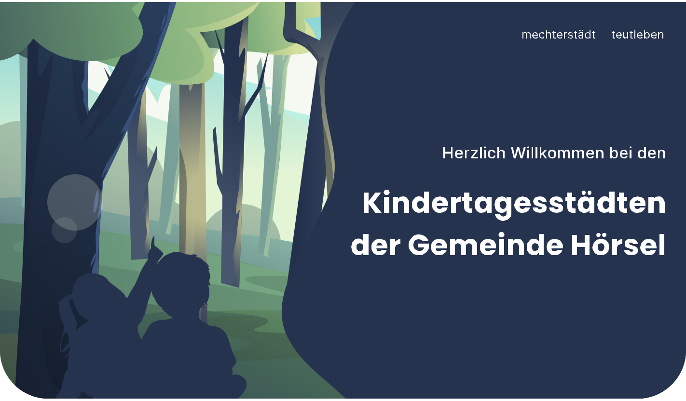

 

  

   
   

  

    Die Kindergärten <strong>Dreikäsehoch</strong> Mechterstädt und <strong>Kleine Strolche</strong> Teutleben sind die zwei kommunalen Kindergarteneinrichtung der Gemeinde Hörsel.
     
    <a href="https://github.com/kitashoersel/website/issues/newtemplate=bug_report.md">Melde einen Fehler</a>
    ·
    <a href="https://github.com/kitashoersel/website/issues/newtemplate=feature_request.md">Feature anfragen</a>
  

  

  	
  

  
Inhaltsverzeichnis

  <ol>
    <li><a href="#👋-einstieg">Einstieg</a></li>
    <li><a href="#🧑‍💻-entwicklung">Entwicklung</a></li>
    <li><a href="#🔓-lizenz">Lizenz</a></li>
    <li><a href="#💌-kontakt">Kontakt</a></li>
  </ol>

## 👋 Einstieg

Willkommen auf dem offiziellen Repository der Kindergärten der Gemeinde Hörsel! Hier findest du den kompletten Programmcode der Website, die Deployment Dateien und Infrastructure as Code Skripte um einen eigenen Server bereitzustellen. 

Das Repository beinhaltet zusätzlich einige Tutorials, welche die genutzten Technologien vorstellen und erklären und wie das Projekt strukturiert ist. Dies soll den Hintergrund haben, dass in Zukunft auch andere Entwickler:innen an diesem Projekt teilnehmen können, falls sie das wollen oder ich (Tobias Kärst) nicht mehr der Maintainer des Projektes is.t

(<a href="#top">Zurück nach Oben</a>)

## 🧑‍💻 Entwicklung

❗Dieser Abschnitt wird momentan noch verfasst.

Schön dass du die Website der Kindergärten der Gemeinde Hörsel verbessern möchtest. Open Source lebt von Entwickler:innen wie dir! 👏 

Noch zu schreiben:
- Fork, Pull Request workflow
- Verwendete Technologien
- Editor Setup
- Style guide
- Figma Datei verlinken
- `netsh interface portproxy add v4tov4 listenport=3000 listenaddress=0.0.0.0 connectport=3000 connectaddress=172.22.75.182`
- https://icomoon.io/app/#/select/image
- https://svgomg.net/
- https://icon-sets.iconify.design/

(<a href="#top">Zurück nach Oben</a>)

## Todo

**Future**

- Exchange `~lib` with `$lib` alias after typescript 5.0 releases 

**I18n**

- clean configuration and seo from translated values
- translate all urls and seo configs in pages

**Refactoring**

- Remove tailwindcss from project
  - translate theme to scss lib
  - create scss folder structure

**Misc**

- clean / sort `core` and `common` folders
  - put image components in image module
  - carousel in own module
- split footer in smaller components

**Performance**

- add cache control header to graphql requests https://kit.svelte.dev/docs/load#cookies-and-headers
- refactor graphql client to be a common module
- redis as top level cache for html output

## 🔓 Lizenz

All meine Softwareprojekte werden unter der MIT Lizenz vertrieben. Für mehr Informationen kannst du in die [Lizenzdatei](./LICENSE) schauen.

(<a href="#top">Zurück nach Oben</a>)

## 💌 Kontakt

Der Maintainer und ursprüngliche Entwickler des Projektes ist [Tobias Kärst](https://github.com/DevTobias). Für alle Fragen bezüglich Zugriff auf das Projekt, Technologien und so weiter kannst du mir einfach eine [email](mailto:tobi.kaerst@gmx.de) schicken oder mich auf Discord (DevTobias#1392) hinzufügen. 

(<a href="#top">Zurück nach Oben</a>)

